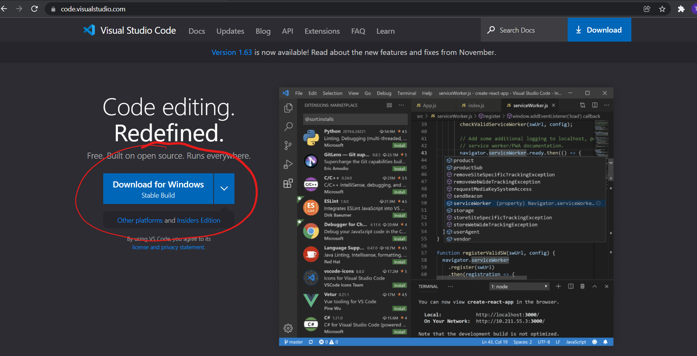
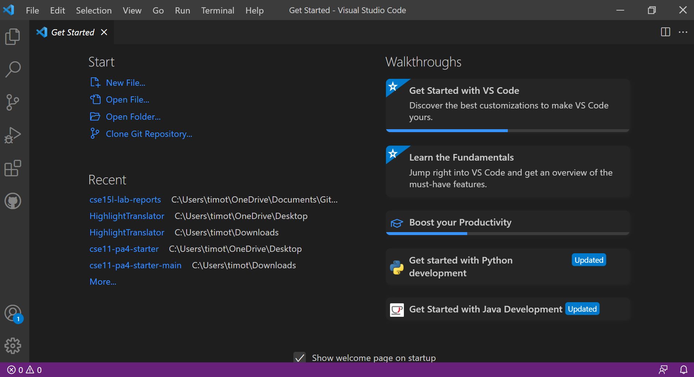

# Installing VScode
* Click this [link](https://code.visualstudio.com/) to install VScode

* When you launch the app, it should look like the following:

#  Remotely Connecting
* To remotely connect to a server, first open a new terminal from VScode

* Trying Some Commands
* Moving Files with scp
* Setting an SSH Key
* Optimizing Remote Running
